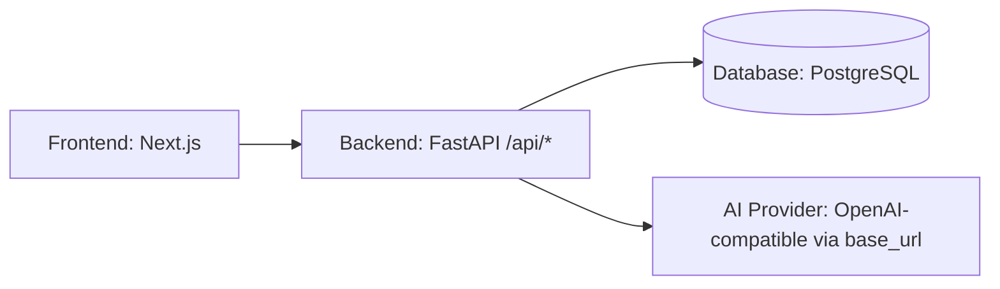
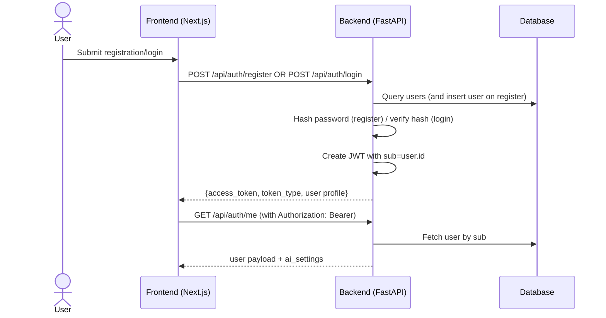
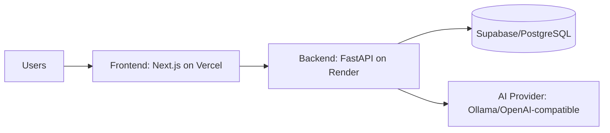

# ARCHITECTURE.md

## Project Overview

### Purpose
A full-stack “Code Review Assistant” web application that lets users:
- Register/login with email+password.
- Create projects.
- Upload one or more source files into a project.
- Ask an AI model to:
  - Perform code reviews on uploaded code (optionally per-file).
  - Answer codebase questions in a chat-like flow.
- Persist AI review results for later browsing.

### Core Features
- **Authentication**: JWT-based login/registration and “/me” profile endpoint.
- **Project Management**: CRUD-lite (create, list, delete).
- **File Management**: single and multiple upload; view file list and fetch file content; delete files.
- **AI Review Workflow**: review per project (all files) or per specific file; stores structured JSON output.
- **AI Chat/Workspace**: chat endpoint that builds a code context from project files and queries an OpenAI-compatible provider.
- **User-specific AI Provider Settings**: provider/base URL/model/api key stored in the user row and passed per request.

### Target Users
- Recruiters and interviewers evaluating practical full-stack architecture.
- Open-source contributors wanting a code-first architecture overview.
- Software engineers interested in AI-provider abstraction, review persistence, and auth.

---

## Technology Stack

### Frontend
- **Next.js (React, TypeScript)**
- Component styling via **TailwindCSS** (Tailwind dependencies present)
- API communication via **Axios**
- UI utility: **lucide-react** icons and **react-syntax-highlighter**

### Backend
- **FastAPI**
- **SQLAlchemy** (sync engine + session)
- **PostgreSQL** via `DATABASE_URL` (implied by schema usage and hosted DB references)
- **JWT auth** via `python-jose` (`jose.jwt`)
- **Password hashing** via `passlib` with bcrypt

### Database
- Relational database with tables mapped in SQLAlchemy models:
  - `users`, `projects`, `files`, `reviews`
- Database URL: `DATABASE_URL`

### Authentication
- Email/password registration and login.
- JWT token payload contains `sub = user.id`.
- Protected endpoints require `Authorization: Bearer <token>`.
- No refresh tokens; token is stateless.

### AI Integrations
- Uses the **OpenAI Python SDK** pointed at a configurable `base_url`.
- This makes AI providers **OpenAI-compatible** (Ollama, OpenAI, and other compatible endpoints).
- Per-request model selection (`ai_model`) and provider configuration.

### Deployment Platforms (inferred from CORS + docs)
- **Vercel** (Next.js frontend)
- **Render** (typical for FastAPI backends; also listed in repository context)
- **Supabase / PostgreSQL** (mentioned in architecture context and database URL naming pattern)

---

## High-Level System Architecture




> Note: AI Provider is contacted by the backend during **/api/reviews/** and **/api/chat/** requests.

---

## Repository Structure (inferred from code paths)

### Root
- `ARCHITECTURE.md` (legacy doc; not used for this document)
- `AI_USAGE.md` (AI approach and representative prompts; not used as an authoritative architecture source)

### Backend (`backend/`)
- `backend/requirements.txt`: Python dependencies.
- `backend/app/main.py`: FastAPI app initialization, CORS, routers, and startup schema guard.
- `backend/app/database.py`: SQLAlchemy engine/session + `get_db` dependency.
- `backend/app/models/`
  - `user.py`: `User` model incl. AI provider settings.
  - `project.py`: `Project` model.
  - `file.py`: `File` model storing uploaded content.
  - `review.py`: `Review` model storing AI JSON review output.
- `backend/app/routers/`
  - `auth.py`: `/api/auth/*` endpoints (register/login/me/settings).
  - `projects.py`: `/api/projects/*` endpoints.
  - `files.py`: `/api/files/*` endpoints (upload, list, content, delete).
  - `reviews.py`: `/api/reviews/*` endpoints (create review, list, detail).
  - `chat.py`: `/api/chat/*` endpoint for question answering.

### Frontend (`frontend/`)
- Next.js app routing under `frontend/app/*` (login/dashboard/about).
- Dashboard components under `frontend/app/dashboard/projects/components/*`.
- `frontend/app/lib/userProfile.ts`: client-side user/profile handling.
- `frontend/frontend/next.config.ts`: Next config.

---

## Frontend Architecture

### Routing
- Next.js App Router pages:
  - `/app/page.tsx`: landing page
  - `/app/login/page.tsx`: login screen
  - `/app/dashboard/page.tsx`: authenticated dashboard
  - `/app/dashboard/projects/page.tsx`: project list + workspace entry
  - `/app/about/page.tsx`: about page

### Components
- `AppShell` / layout-level components provide authenticated navigation UI.
- Dashboard sub-components:
  - **AISettings**: edits user AI provider/base URL/model/api key.
  - **ReviewHistory**: lists previous reviews.
  - **ChatWithCode**: calls chat endpoint with current question.

### State Management
- Local state (React `useState` / `useEffect`) and derived state.
- User profile is persisted client-side and rehydrated across pages (inferred from `userProfile.ts` usage and typical flow).

### API Communication
- Axios is used for calling FastAPI endpoints under `/api/*`.
- Authorization headers are attached using the JWT access token.

### User Flows
- **Onboarding**: register → login → settings (optional) → dashboard.
- **Project flow**: create project → upload files → generate reviews → view history.
- **Chat flow**: input question → backend builds code context from uploaded files → returns AI answer.

---

## Backend Architecture

### FastAPI Structure
- `backend/app/main.py`
  - Creates FastAPI instance.
  - Adds CORS middleware.
  - Runs `Base.metadata.create_all(...)`.
  - Executes `ensure_user_settings_columns()` to ALTER table columns if missing.
  - Includes routers under:
    - `/api/auth`
    - `/api/projects`
    - `/api/files`
    - `/api/reviews`
    - `/api/chat`

### Routers
- **`auth.py`**
  - `POST /api/auth/register`
  - `POST /api/auth/login`
  - `GET /api/auth/me`
  - `PUT /api/auth/settings`

- **`projects.py`**
  - `POST /api/projects/`
  - `GET /api/projects/`
  - `DELETE /api/projects/{project_id}`

- **`files.py`**
  - `POST /api/files/{project_id}/upload`
  - `POST /api/files/{project_id}/upload-multiple`
  - `GET /api/files/{project_id}` (list)
  - `GET /api/files/content/{file_id}` (content)
  - `DELETE /api/files/{file_id}`

- **`reviews.py`**
  - `POST /api/reviews/`
  - `GET /api/reviews/{project_id}` (list)
  - `GET /api/reviews/detail/{review_id}`

- **`chat.py`**
  - `POST /api/chat/`

### Services (logical)
This codebase keeps “services” as inline logic in routers rather than a separate service folder.
Key responsibilities per router:
- AI prompt construction + response parsing.
- Database query orchestration and ownership checks.

### Authentication
- Each protected router defines a `get_current_user()` dependency.
- Uses `HTTPBearer` to read `Authorization` header.

### Database Layer
- `backend/app/models/*` defines SQLAlchemy ORM classes.
- `backend/app/database.py` defines:
  - `engine` from `DATABASE_URL`.
  - `SessionLocal`.
  - `get_db()` dependency.

### Error Handling
- Uses `HTTPException` with explicit HTTP status codes:
  - `401` invalid/missing user
  - `400` invalid AI settings
  - `403` authorization failure (file deletion)
  - `404` missing project/file/review
  - `500` AI failures or JSON parsing errors

---

## Database Design

### Tables
- **users**
  - `id` (PK)
  - `email` (unique)
  - `username` (unique)
  - `hashed_password`
  - `role`
  - `ai_provider`, `ai_base_url`, `ai_model`, `ai_api_key`
  - `created_at`

- **projects**
  - `id` (PK)
  - `name`
  - `description`
  - `owner_id` (FK → users.id)
  - `created_at`

- **files**
  - `id` (PK)
  - `filename`
  - `filepath`
  - `content` (decoded text stored at upload time)
  - `project_id` (FK → projects.id)
  - `uploaded_at`

- **reviews**
  - `id` (PK)
  - `project_id` (FK → projects.id)
  - `file_id` (nullable FK → files.id)
  - `review_type` (e.g., general/security/performance/quality)
  - `summary`
  - `issues` (JSON)
  - `recommendations` (JSON)
  - `created_at`

### Relationships
- `User` 1—N `Project`
- `Project` 1—N `File`
- `Project` 1—N `Review`
- Optional `Review.file_id` points to a `File` (nullable)

### ER Diagram

```mermaid
erDiagram
  USERS ||--o{ PROJECTS : owns
  PROJECTS ||--o{ FILES : contains
  PROJECTS ||--o{ REVIEWS : has
  FILES ||--o{ REVIEWS : referenced_by

  USERS {
    int id PK
    string email
    string username
    string hashed_password
    string role
    string ai_provider
    string ai_base_url
    string ai_model
    string ai_api_key
    datetime created_at
  }
  PROJECTS {
    int id PK
    string name
    string description
    int owner_id FK
    datetime created_at
  }
  FILES {
    int id PK
    string filename
    string filepath
    text content
    int project_id FK
    datetime uploaded_at
  }
  REVIEWS {
    int id PK
    int project_id FK
    int file_id FK nullable
    string review_type
    text summary
    json issues
    json recommendations
    datetime created_at
  }
```


### Data Flow (DB)
- Upload → insert/update `files` rows.
- Create review → read `projects` + `files`, call AI, parse JSON, insert `reviews`.
- Chat → reads `projects` and `files` but does not persist chat transcripts (only returns `answer`).

---

## Authentication Flow

### Sequence Diagram




### Registration
- `POST /api/auth/register`
- Checks unique email.
- Hashes password with bcrypt.
- Creates user with default AI settings.

### Login
- `POST /api/auth/login`
- Verifies password.
- JWT payload: `{ "sub": "<user_id>" }`.

### JWT generation
- `jose.jwt.encode` with `SECRET_KEY` and `ALGORITHM`.

### Protected routes
Require `Authorization: Bearer <token>`:
- Projects, files, reviews, chat endpoints.

---

## File Upload Flow

1. Client calls `POST /api/files/{project_id}/upload` or `/upload-multiple`.
2. Backend validates:
   - project exists and is owned by current JWT user.
3. Backend saves the physical file under `backend/app/uploads/` equivalent folder `uploads/`.
4. Backend reads saved file bytes and decodes to text:
   - try UTF-8
   - fallback to Latin-1
5. Backend stores the decoded text in the `files.content` column.
6. If filename already exists for the project, backend updates the existing row instead of creating a new one.

---

## AI Review Workflow

### Flowchart

```mermaid
flowchart TD
  A[Client requests review] --> B[POST /api/reviews/]
  B --> C[Backend validates project ownership]
  C --> D[Load code context from files in DB]
  D --> E[Select REVIEW_PROMPTS by review_type]
  E --> F[Create OpenAI-compatible client with base_url + api_key]
  F --> G[Send chat.completions.create with system + user prompt]
  G --> H[Receive response.content]
  H --> I[Strip markdown code fences if any]
  I --> J[json.loads(parsed string)]
  J --> K[Persist Review row (summary, issues, recommendations)]
  K --> L[Return review JSON to client]
```


### File processing
- When `file_id` is provided, backend uses that single file.
- Otherwise, backend concatenates **all files** belonging to the project into one code context string.

### AI request generation
- The backend uses a system prompt template (varies by review type).
- The user message includes:
  - the concatenated code content
  - instruction “Review this code: ...”

### Response handling
- Expects raw JSON output.
- Cleans markdown fences ```json ... ``` if present.
- Parses JSON and maps:
  - `summary`
  - `issues[]`
  - `recommendations[]`

### Review storage
- Creates a `reviews` row:
  - `project_id`, optional `file_id`, `review_type`
  - stores `summary`, `issues`, `recommendations`

---

## API Documentation

Discovered endpoints (method, route, purpose, auth):

### Auth (`/api/auth`)
- **POST** `/api/auth/register` (no auth)
  - Create user account.
- **POST** `/api/auth/login` (no auth)
  - Verify credentials and issue JWT.
- **GET** `/api/auth/me` (JWT required)
  - Return current user profile + AI settings.
- **PUT** `/api/auth/settings` (JWT required)
  - Update per-user AI provider settings.

### Projects (`/api/projects`)
- **POST** `/api/projects/` (JWT required)
  - Create project.
- **GET** `/api/projects/` (JWT required)
  - List projects for current user.
- **DELETE** `/api/projects/{project_id}` (JWT required)
  - Delete project owned by current user.

### Files (`/api/files`)
- **POST** `/api/files/{project_id}/upload` (JWT required)
  - Upload a single file into a project.
- **POST** `/api/files/{project_id}/upload-multiple` (JWT required)
  - Upload multiple files; returns per-file results and errors.
- **GET** `/api/files/{project_id}` (JWT required)
  - List files (id, filename, uploaded_at).
- **GET** `/api/files/content/{file_id}` (JWT required)
  - Return `{filename, content}`.
- **DELETE** `/api/files/{file_id}` (JWT required)
  - Delete file (checks project ownership).

### Reviews (`/api/reviews`)
- **POST** `/api/reviews/` (JWT required)
  - Create AI review for a project (optionally scoped to `file_id`).
- **GET** `/api/reviews/{project_id}` (JWT required)
  - List reviews for project.
- **GET** `/api/reviews/detail/{review_id}` (JWT required)
  - Fetch full review details.

### Chat (`/api/chat`)
- **POST** `/api/chat/` (JWT required)
  - Build code context from project files and answer question via AI.

---

## Deployment Architecture

### Components
- **Frontend (Next.js)** hosted on **Vercel**.
- **Backend (FastAPI)** hosted on **Render**.
- **Database** hosted on **Supabase (PostgreSQL)**.

### Deployment Diagram




### Environment Variables (from code)
Backend:
- `DATABASE_URL`: SQLAlchemy engine URL.
- `SECRET_KEY`: JWT signing key.
- `ALGORITHM`: JWT algorithm (default `HS256`).
- (Optional defaults) AI provider settings defaults handled in code.

CORS allowed origins:
- `http://localhost:3000`
- `https://code-review-assistant-mu.vercel.app`

### Production flow
1. User authenticates via frontend.
2. Frontend calls FastAPI `/api/*` endpoints with JWT.
3. FastAPI queries Supabase for persisted data.
4. For review/chat actions, FastAPI calls an OpenAI-compatible AI endpoint.

---

## Security Considerations

### Authentication
- JWT via `SECRET_KEY` and `ALGORITHM`.
- `Authorization: Bearer` required for protected endpoints.

### Authorization
- Project and file operations filter by `owner_id == current_user.id`.
- File deletion additionally checks ownership.

### JWT handling
- Token payload uses `sub` = user id.
- No token revocation mechanism.
- No explicit token expiration configured in code.

### API security
- CORS is restricted to known frontend origins.
- AI provider API keys are passed in the request body from the client-side settings.

### Database security
- Ownership checks prevent cross-user access to project-scoped resources.
- Sensitive fields:
  - `users.ai_api_key` stored in DB.

### Secrets management
- `SECRET_KEY` must be set in production.
- AI provider API keys stored per user and also transmitted per request.

---

## Scalability Considerations

### Current limitations / bottlenecks
- AI calls are synchronous; slow AI providers block the request.
- File content is stored as decoded text in DB (`files.content`), which may grow unbounded.
- Chat endpoint rebuilds code context by concatenating all project files every request.
- No caching or background job queue for AI reviews.

### Likely bottlenecks
- Large projects: code_context concatenation and token limits.
- Database reads: full file list retrieval per review/chat.

### Future improvements
- Add pagination for reviews/projects/files.
- Introduce async SQLAlchemy + async OpenAI calls.
- Add job queue (Celery/RQ) for AI reviews.
- Store embeddings and perform retrieval instead of full concatenation.
- Add token counting/splitting for large files.
- Add request rate limiting and structured logging.

---

## Developer Onboarding Guide

### 1) Install dependencies
Backend:
- `cd backend`
- `python -m pip install -r requirements.txt`

Frontend:
- `cd frontend`
- `npm install`

### 2) Configure environment variables
Backend `.env` expected fields:
- `DATABASE_URL`
- `SECRET_KEY`
- `ALGORITHM` (optional)

### 3) Run backend
- `uvicorn backend.app.main:app --reload`

### 4) Run frontend
- `cd frontend`
- `npm run dev`

### 5) Database setup
- Ensure `DATABASE_URL` points to a PostgreSQL instance.
- The backend auto-creates tables via `Base.metadata.create_all`.
- On startup it also runs `ensure_user_settings_columns()` to add missing user AI settings columns.

### 6) Deploy
- Frontend to Vercel with appropriate NEXT public env vars (if any are used for API base URL).
- Backend to Render; configure environment vars for DB and JWT.
- Supabase/PostgreSQL for persistence.

---

## File Upload Flow and AI Workflows Summary (at-a-glance)
- Upload files → save to disk + DB.
- Create review → load DB content → send AI prompt → parse JSON → persist review.
- Chat → load DB content → send AI prompt → return answer (not persisted).

